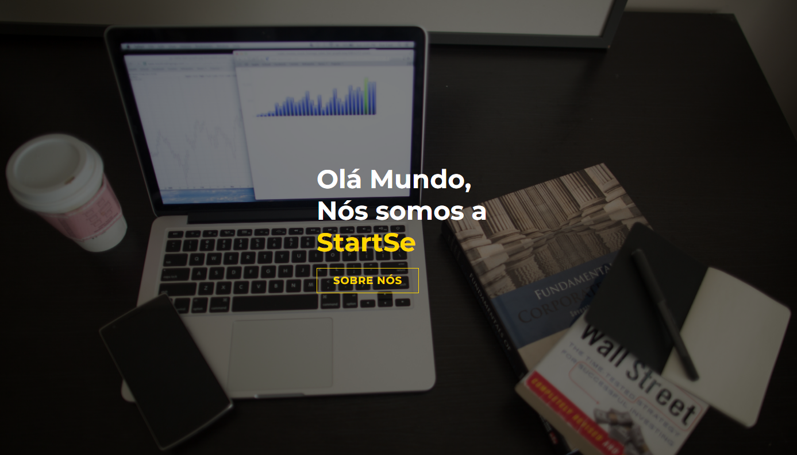
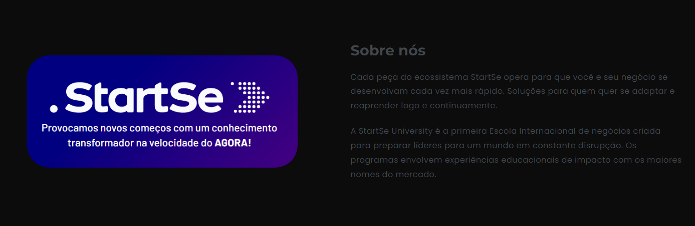
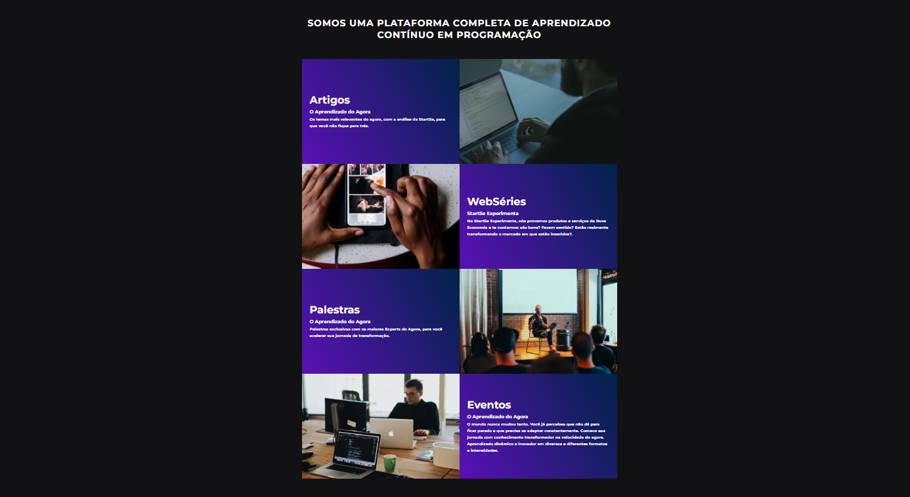
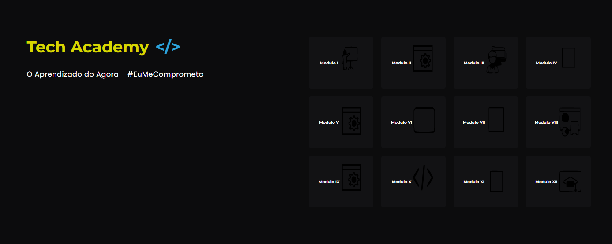
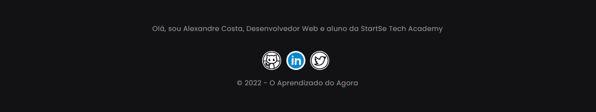

<h1 align="center">
  Desafio Tech Academy
</h1>

*O desafio consiste em refatorar o projeto realizado na live coding do dia 28/05, utilizando tags semânticas, segue os critérios e pesos:*

* Criatividade (peso 2)

*O que é criatividade?
Altere as animações, adicione um contexto interessante para o site, como por exemplo, criar um portfólio para fotógrafos,lista de lugares que você já viajou ou gostaria de conhecer, uma página com seções do seu aprendizado com o tech academy, enfim… o céu é o limite, bora para cima!*

* Refatoração com tags semânticas (peso 1)

* Organização do css (peso 1)

 

<h2 align="center">
  Projeto :-)
</h2>

<h2 align="center">
  
</h2>

<!---->
---

<h3 align="left">
  Home 
</h3>

<h3 align="left">
  Startse 
</h3>

<h3 align="left">
  Learning
</h3>

<h3 align="left">
  Footer
</h3>

---

## Tecnologias e ferramentas utilizadas
Para o desenvolvimento deste projeto utilizei:

- HTML5
- CSS3
- JavaScript
- Visual studio Code v1.67.1
